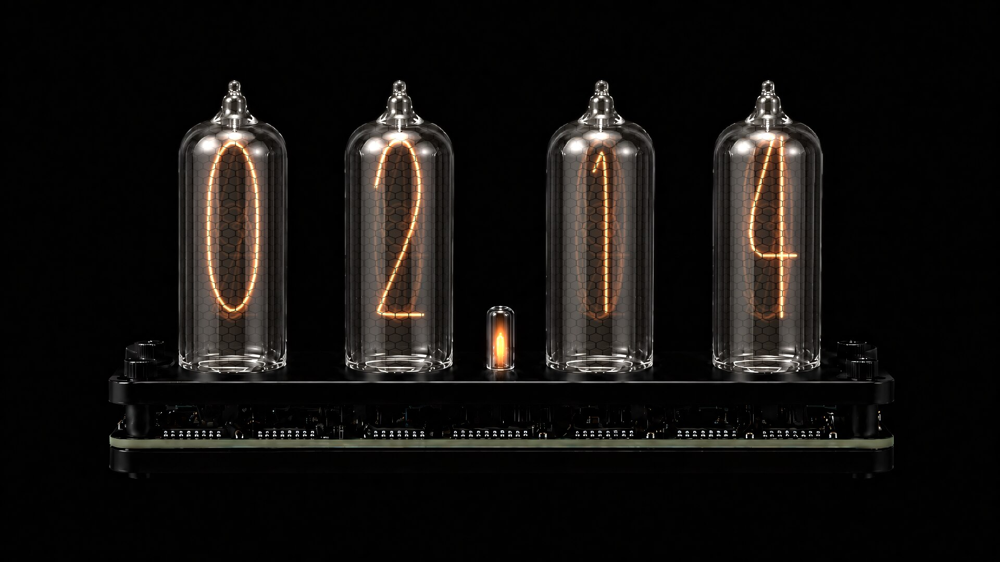
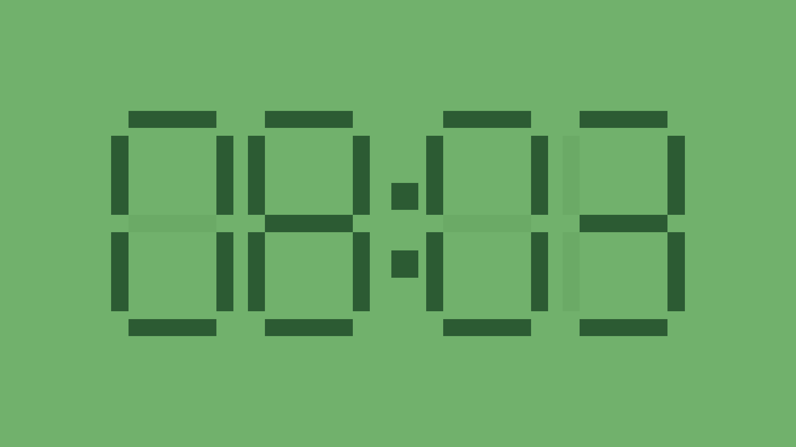
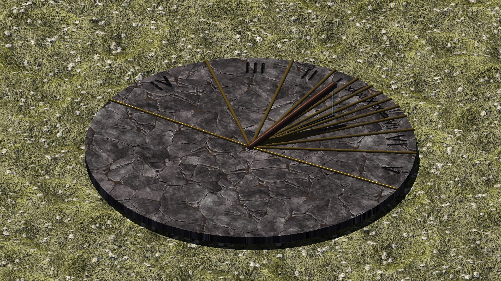
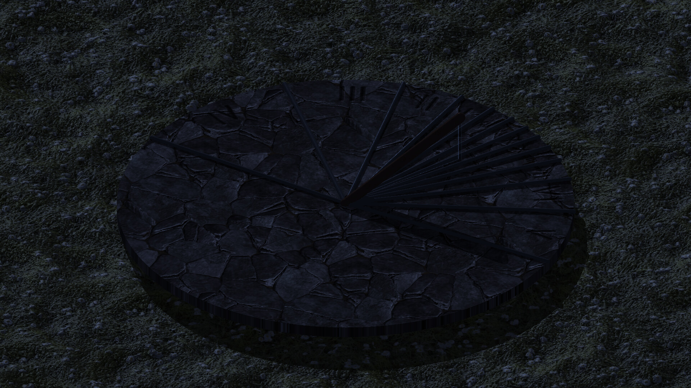

# nixalarm

`nixalarm` is a small Linux alarm utility with a large green seven-segment clock display. It reads local time, rings at a requested local `HH:MM`, and supports local audio files, internet radio streams, optional RTL-SDR weather-band audio, and a built-in generated alarm tone.

The visual style is intentionally simple: dark green background, bright green segment blocks, dim inactive segments, and optional glow.

## Screenshots

| `nixie` | `sinnoh_green` |
|---|---|
|  |  |

| `auto_dial` (day, sundial) | `auto_dial` (night, moondial) |
|---|---|
|  |  |

See [Themes](#themes) below for the full list and what each one draws.

## Build

Dependencies:

- C++20 compiler
- CMake
- SDL2
- FFmpeg development libraries: `libavformat`, `libavcodec`, `libavutil`, `libswresample`
- FluidSynth development library
- librsvg development library for the SVG analog clock face
- Optional for SDR weather-band wake-up, only if you have SDR hardware: `rtl_fm`

Example:

```sh
cmake -S . -B build
cmake --build build
```

Generic source install:

```sh
make
sudo make install
```

Arch package build:

```sh
cd packaging/arch
makepkg -f
```

The Arch `PKGBUILD` lists common Arch and Arch-port targets explicitly:
`x86_64`, `aarch64`, `armv7h`, `riscv64`, and `loong64`. Release builds from
this repository only prebuild the host architecture.

AppImage build:

```sh
packaging/appimage/build-appimage.sh
```

Debian package build:

```sh
packaging/deb/build-deb.sh
```

Fedora/RPM package build:

```sh
packaging/rpm/build-rpm.sh
```

Flatpak bundle build:

```sh
packaging/flatpak/build-flatpak.sh
```

Nix packaging example:

```sh
cd packaging/nix
nix build
```

Run:

```sh
./build/nixalarm 07:30
```

Run without a time to use the configured `alarms` list:

```sh
./build/nixalarm
```

Set `alarms = []` in the config for clock-only desktop launches.

Manual pages are installed by CMake:

```sh
man nixalarm
man 5 nixalarm
```

## Usage

```text
nixalarm [OPTIONS] [HH:MM]

Options:
  --config PATH        Read config from PATH instead of XDG config.
  --source NAME        Use a configured or built-in source.
  --fullscreen         Start fullscreen.
  --windowed           Start windowed, overriding config fullscreen.
  --list-sources       Print built-in and configured sources.
  --test-source NAME   Play a source immediately.
  --help               Print help.
  --version            Print version.
```

Times without `AM` or `PM` are parsed as 24-hour time. Times with `AM` or `PM`
are parsed as 12-hour time:

```sh
nixalarm 19:30
nixalarm "7:30 PM"
```

Controls:

- Space tap while ringing: snooze.
- Space hold while ringing: dismiss after the configured hold duration.
- F11 or `f`: toggle fullscreen.
- `q` or Escape: quit.

## Config

Default path:

```text
$XDG_CONFIG_HOME/nixalarm/config.toml
```

Fallback:

```text
$HOME/.config/nixalarm/config.toml
```

If the selected config file does not exist, `nixalarm` creates it with default
settings before loading it.

Example:

```toml
alarm_source = "generated"
# Desktop/no-argument launches use alarms. Leave empty for clock-only.
alarms = ["07:30", "5:30 PM"]
snooze_minutes = 10
hold_to_stop_seconds = 10
volume = 0.9
source_start_timeout_seconds = 8
fallback_source = "generated"
use_24_hour = false

[window]
width = 800
height = 360
fullscreen = false
always_on_top = false
flash_hz = 2.0

[style]
theme = "terminal_glow"
background = "#07180b"
segment_on = "#6cff57"
segment_off = "#123319"
glow = true
show_seconds = false
roman_numerals = false
analog_midnight_label = "24"
dial_time = "apparent"

[sources.local_song]
type = "file"
path = "/home/user/Music/alarm.flac"

[sources.midi_alarm]
type = "midi"
path = "/home/user/Music/alarm.mid"
soundfont = "/usr/share/soundfonts/default.sf2"

[sources.weather_stream]
type = "internet"
url = "https://example.org/your-stream"

[sources.weatherband]
type = "sdr_weatherband"
frequency_mhz = 162.400
device_index = 0
gain = "auto"
```

A freshly seeded config has all of these commented out, so a new install stays on the offline `generated` alarm and contacts nothing until you ask it to. Set `frequency_mhz` to the NOAA channel covering your area; the seven US channels run 162.400 to 162.550 MHz in 25 kHz steps.

## Built-in sources

- `generated`: procedural alarm tone. The default; needs no files, network, or hardware.
- `weatherband_162_400`, `weatherband_162_425`, `weatherband_162_450`, `weatherband_162_475`, `weatherband_162_500`, `weatherband_162_525`, `weatherband_162_550`: RTL-SDR presets, one per US NOAA weather-band channel.

There are no presets for particular transmitters or regions: which weather-band channel reaches you depends on where you are, so pick the channel for your own area. `--list-sources` prints everything available.

With RTL-SDR hardware, pick your channel:

```sh
./build/nixalarm --source weatherband_162_400 07:30
```

Without SDR hardware, an internet mirror of your local station works as a `type = "internet"` source in your config:

```sh
./build/nixalarm --source my_weather_stream 07:30
```

Internet NOAA-weather-radio URLs are community mirrors and come and go; not every transmitter has a reliable one, which is why the built-in presets are SDR channels rather than stream URLs.

## Themes

Set `theme` in `[style]` before any color overrides. A theme picks both the
clock rendering style and its colors:

```toml
[style]
theme = "sinnoh_green"
show_seconds = false
```

Built-in themes:

- `terminal_glow`: seven-segment digits, original dark green background, bright green glowing digits.
- `sinnoh_green`: seven-segment digits, light green pixel-clock style with dark green block digits, matching the provided Pokémon DS-style reference more closely.
- `nixie`: photoreal nixie-tube digits. Does not use the color overrides below.
- `analog`: SVG-rendered analog dial based on the public-domain Wikimedia Commons animated analog clock, with the original script/branding removed and the hand motion driven by C++.
- `sundial`: a real horizontal sundial, ray-traced in OpenGL, telling the time by the shadow the sun actually casts right now at your `latitude`/`longitude`. Goes dark at night. Does not use the color overrides below.
- `moondial`: the same instrument built for the moon instead, and dark by day. Does not use the color overrides below.
- `auto_dial`: both of the above as one clock — whichever dial can currently be read, crossfading from one to the other at the changeover. Does not use the color overrides below.

You can still override `background`, `segment_on`, `segment_off`, and `glow` after setting `terminal_glow`, `sinnoh_green`, or `analog`; the `nixie`, `sundial`, `moondial`, and `auto_dial` themes ignore them (`background` still fills the area around the dial for the three dial themes).

For `analog`, the theme defaults to a smoothly sweeping red seconds hand; set `show_seconds = false` after `theme = "analog"` to hide only that hand. The face follows the source SVG's 12-hour Arabic dial by default; set `roman_numerals = true` to use the Roman-numeral SVG face. The hands use the same time math as the source SVG's JavaScript in native C++. A small alarm marker appears when an alarm or snooze is pending and pulses red while ringing.

`sundial` and `moondial` are astronomical, not decorative: they compute the real solar or lunar position for the current instant and trace the shadow the gnomon would cast. The dial is read as **hour bands**: the engraved lines are the boundaries *between* hours, drawn at the half hours, and each hour's Roman numeral sits in the band its two boundaries enclose. So you read it by which band the shadow lies in, rather than by the shadow coinciding with a line. The boundaries are laid out for your latitude's summer solstice, the longest day, so the dial carries every hour its light can ever be up for, and each band is closed at both ends.

Every boundary is a **ray from the gnomon foot**, run out to the edge of the disc. That convergence isn't decoration: an hour line is where the plane through the style and the light cuts the plate, and every such plane contains the style, so every hour line must pass through the point where the style meets the plate. A line converging nowhere would not be an hour line at all. It is a ray rather than a full line for the same reason — the shadow only ever falls on the side of the foot away from the light, so the backward half would mark hours that can never be indicated there.

The numerals are *engraved* rather than painted: cut into the plate as a height field the renderer reads as bump, so they fill with shadow under a low sun and flatten out near noon, as a chiselled dial does. Bands narrow sharply toward midday, so each numeral is scaled to the room its own band actually leaves it. By default a dial reads *apparent solar time*, which is not your clock: depending on where you sit in your time zone and how far the equation of time has drifted, solar noon can be an hour or more from 12:00 on your watch, and daylight saving adds another hour on top. `dial_time` in `[style]` chooses what the dial reads:

| `dial_time` | Reads | Corrects for |
|---|---|---|
| `apparent` (default) | The sun's own time, uncorrected — a real dial | nothing |
| `mean` | Local mean solar time | the equation of time (±~16 min over the year) |
| `clock` | Your wall clock | the above, plus your time zone and daylight saving |

Note that `mean` alone will **not** make the dial agree with your watch — local mean time is still keyed to *your longitude*, not your time zone's standard meridian, so it can sit an hour or more off. `clock` is the one that matches a watch; it takes the zone offset and DST from the system, so it follows your zone's own rules.

The correction is applied by rendering the light at the hour angle a sun keeping that time would have, leaving declination alone so shadows keep their real seasonal length — the same trick a heliochronometer plays mechanically. One honest consequence: in a corrected mode the rendered sun also rises and sets at corrected times. **Set `latitude` and `longitude` in the top level of the config** (signed degrees, +N/-S and +E/-W) or the dial will be built and read for a point off the west coast of Africa. The plate's tilt and the hour-line spacing are optimized for your latitude at startup, and the camera is pinned to the plate, so the framing is the same wherever you are. All three need OpenGL 3.3.

A dial only works while its own light is up, so `sundial` and `moondial` go dark for half the day, the way the real instrument in a garden does. `auto_dial` is the one that stays useful around the clock: it shows whichever dial can currently be read and hands over when that stops being true.

The changeover is keyed to readability rather than to sunset. A dial stops telling the time when the gnomon's shadow slides off the edge of the plate, which happens some while before the sun actually sets, and that is when the moon dial takes over — provided the moon is up and more than roughly a quarter lit, since a thinner crescent casts no shadow you could read. When neither dial works (the small hours under a new moon) the face holds the one it was showing and goes dark, since there is genuinely no time to read. The two dials are different instruments — the plate tilt and hour lines differ, because a moon dial is built for a different apparent motion — so the changeover visibly dissolves one into the other rather than pretending they are the same object.

None of the dial faces draw a ringing indicator yet — a ringing alarm is signalled by sound alone.

## MIDI

MIDI alarm sources use FluidSynth. Set `soundfont` in the source config if your
system does not provide a common default SoundFont path.
